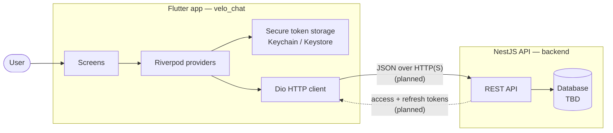

# Architecture

## Overview

Velo Chat is a monorepo with two deployable components:

| Component | Path | Role |
| --- | --- | --- |
| Mobile client | `velo_chat/` | Flutter app (Android & iOS) that renders the UI and owns the user session |
| API | `backend/` | NestJS REST API (TypeScript, ESM) intended to own auth, users and chat data |

Supporting directories:

| Path | Purpose |
| --- | --- |
| `docs/` | Technical documentation (this folder) |
| `.vscode/` | Shared editor settings (Dart formatting on save) |

## System context



## Technology stack

### Mobile (`velo_chat/`)

| Concern | Choice | Version |
| --- | --- | --- |
| Framework | Flutter (stable channel) | Dart SDK `^3.13.4` |
| State management | Riverpod | `^3.4.3` (`flutter_riverpod`) |
| Routing | go_router | `^18.0.2` |
| HTTP client | Dio | `^5.11.1` |
| Token storage | flutter_secure_storage | `^11.2.0` |
| Toast notifications | fluttertoast | `^10.0.0` |
| Lints | flutter_lints | `^6.0.0` |

Target platforms: **Android** and **iOS** only; the desktop/web platform folders were removed.

### Backend (`backend/`)

| Concern | Choice | Version |
| --- | --- | --- |
| Framework | NestJS | `^12.0.1` |
| Language | TypeScript (ESM, `nodenext`) | `^6.0.2` |
| Package manager | pnpm | lockfile `pnpm-lock.yaml` |
| Tests | Vitest | `^4.1.2` |
| Lint / format | oxlint + Prettier | `^1.58.0` / `^3.4.2` |

## Repository layout

```
velo-chat/
├── backend/                  # NestJS API
│   ├── src/                  # Application source
│   ├── test/                 # E2E tests
│   ├── vitest.config.ts      # Unit test configuration
│   └── vitest.config.e2e.ts  # E2E test configuration
├── docs/                     # Technical documentation
├── velo_chat/                # Flutter app
│   ├── lib/                  # Dart source
│   └── test/                 # Widget/unit tests
└── README.md
```

## Flutter app architecture

The app uses a lightweight layered structure, grouped by responsibility rather than by feature (at this scale):

```
Screens (UI)  ──reads/writes──▶  Providers (state)  ──uses──▶  Services / Shared (infra)
```

- **Screens** are widgets; `ConsumerWidget` / `ConsumerStatefulWidget` when they interact with Riverpod.
- **Providers** own application state and orchestrate actions (`AuthController`).
- **Services / shared** contain infrastructure with no UI knowledge (Dio client, `TokenStorage`).

Details: [Mobile app documentation](./mobile.md).

## Backend architecture

The backend currently contains only the Nest bootstrap (`src/main.ts`) and the root module (`src/app.module.ts`). Domain code is expected to be added as feature modules (`auth`, `users`, `conversations`, `messages`).

Details: [Backend documentation](./backend.md).

## Key design decisions

| Decision | Rationale |
| --- | --- |
| Riverpod instead of `setState`/`provider`/bloc | Compile-safe dependency injection, testable providers, no `BuildContext` required for logic |
| Auth state drives routing via go_router redirects | Single source of truth for the session; no imperative navigation needed after login/logout |
| Tokens in OS secure storage | Keychain (iOS) / Keystore-backed storage (Android) instead of plain preferences |
| Backend as a separate ESM TypeScript service | Independent deployability and a strict, modern module system (`nodenext`) |
| Vitest instead of Jest | ESM-native, fast, shares tooling with the Vite ecosystem |

## Planned components

- Backend feature modules: authentication, users, conversations, messages.
- Realtime messaging (WebSocket) and push notifications.
- Persistent database behind the API.
- CI pipeline running `flutter analyze` / `flutter test` and `pnpm lint` / `pnpm test` / `pnpm run build`.

## Related documentation

- [Mobile app](./mobile.md)
- [Backend](./backend.md)
- [Authentication](./authentication.md)
- [Development](./development.md)
