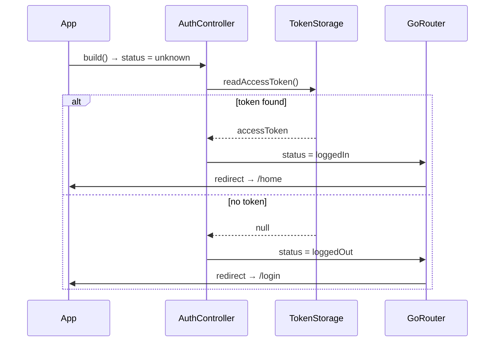
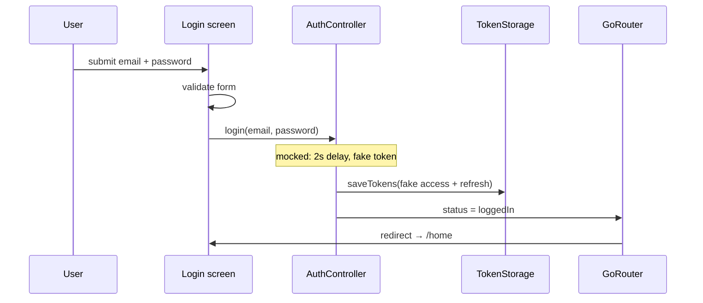
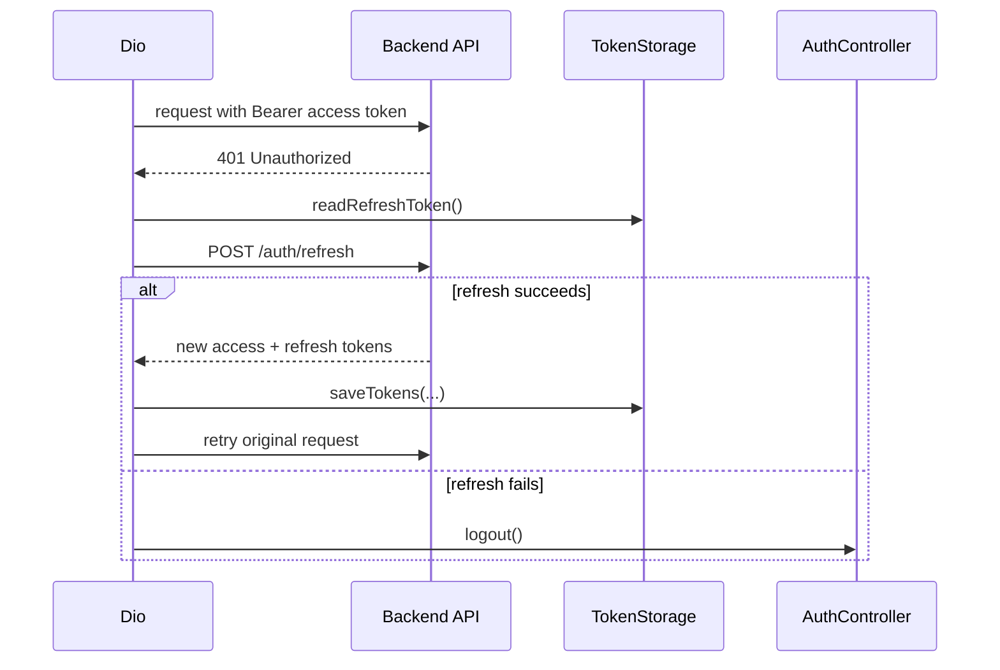

# Authentication

This document describes how Velo Chat models user sessions, the flows implemented today, and the planned contract with the backend.

> **Status:** the client implementation is complete for a mocked flow. API integration and the backend auth module are not implemented yet.

## Goals

- Keep a single source of truth for the session on the client (`AuthController`).
- Never persist credentials or tokens outside OS-protected storage.
- Make route protection declarative (router redirects, not imperative navigation).
- Support refresh-token rotation transparently to screens.

## Session model

`AuthState` (`velo_chat/lib/providers/auth_provider.dart`) contains:

| Field | Type | Description |
| --- | --- | --- |
| `status` | `AuthStatus` | `unknown` \| `loggedOut` \| `loggedIn` |
| `accessToken` | `String?` | Set only when `loggedIn` (in-memory copy) |

`AuthController` exposes `restore()`, `login(email, password)` and `logout()`, and is registered as `authProvider`.

## Flows

### 1. Startup / session restore



While `status` is `unknown`, the router keeps the app on `/splash`.

### 2. Login

Current (mocked) implementation:



Planned implementation: `AuthController.login()` calls `POST /auth/login`, stores the returned tokens, then sets `status = loggedIn`. The router redirect happens automatically.

### 3. Logout

`AuthController.logout()`:

1. Clears tokens through `TokenStorage.clear()`.
2. Sets `status = loggedOut`.
3. The router redirects to `/login`.

`Home` currently triggers logout from a button.

### 4. Token refresh (planned)

Not implemented. The target behaviour is a Dio interceptor on `401`:



## Token storage

`TokenStorage` (`velo_chat/lib/shared/common/token_storage.dart`) wraps `flutter_secure_storage`:

| Method | Description |
| --- | --- |
| `saveTokens({accessToken, refreshToken})` | Persists both tokens |
| `readAccessToken()` | Returns the access token or `null` |
| `readRefreshToken()` | Returns the refresh token or `null` |
| `clear()` | Deletes both tokens |

TODO: the storage keys (`_accessKey`, `_refreshKey`) are currently empty strings and must be set to stable, namespaced values (e.g. `velo_access_token`, `velo_refresh_token`) before any release — changing keys later invalidates existing sessions.

Platform notes: data is stored in the iOS Keychain / Android Keystore-backed storage and survives app restarts; it is removed on uninstall and when `clear()` is called.

## Route protection

The router redirects on every auth state change. The full rules are documented in [Mobile app → Routing](./mobile.md#routing). Summary:

- `unknown` → force `/splash`
- `loggedOut` → force `/login`
- `loggedIn` → leave `/splash` and `/login` for `/home`

## Planned API contract

All endpoints are relative to the configured `baseUrl`. Proposed shapes:

### `POST /auth/login`

```json
// Request
{ "email": "user@example.com", "password": "secret" }

// 200 OK
{ "accessToken": "<jwt>", "refreshToken": "<opaque>" }
```

### `POST /auth/refresh`

```json
// Request
{ "refreshToken": "<opaque>" }

// 200 OK
{ "accessToken": "<jwt>", "refreshToken": "<opaque>" }
```

### `POST /auth/logout`

```
Authorization: Bearer <accessToken>
```

Error responses should follow the NestJS default exception shape:

```json
{ "statusCode": 401, "message": "Invalid credentials", "error": "Unauthorized" }
```

## Security considerations

- Tokens are only written to secure storage — never to logs, analytics or plain preferences.
- Access tokens should be short-lived; refresh tokens should be rotated on every refresh (planned).
- Always use TLS outside local development.
- Clear the session on logout, on refresh failure, or on any detected token theft.
- The mocked login must be removed before shipping.

## Implementation checklist

- [ ] Define `TokenStorage` keys.
- [ ] Wire login to `POST /auth/login` via `dioProvider`.
- [ ] Attach bearer token in the `onRequest` interceptor.
- [ ] Implement `401` refresh/retry in the `onError` interceptor.
- [ ] Implement the backend auth module and token issuance.
- [ ] Add tests for restore, login, logout and router redirects.
