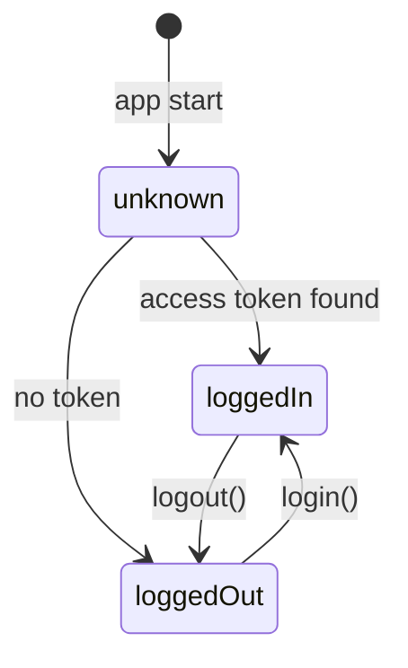

# Mobile app (Flutter)

The client is a Flutter application in [`velo_chat/`](../velo_chat) targeting Android and iOS.

## Project structure

```
velo_chat/lib/
├── main.dart                     # Entry point: runApp(ProviderScope(child: App()))
├── app.dart                      # MaterialApp.router + Material 3 theme
├── providers/
│   ├── auth_provider.dart        # Session state machine (AuthController)
│   ├── router_provider.dart      # GoRouter instance with auth redirects
│   └── token_storage_provider.dart
├── screens/
│   ├── splash.dart               # Shown while the session is restored
│   ├── login.dart                # Email/password form
│   └── home.dart                 # Post-login placeholder + logout
├── services/
│   └── connection_instance.dart  # dioProvider (Dio instance)
└── shared/common/
    └── token_storage.dart        # Secure token persistence
```

## Bootstrap

1. `main.dart` runs `ProviderScope` (the Riverpod root container) around `App`.
2. `App` (a `ConsumerWidget`) watches `routerProvider` and renders `MaterialApp.router`.
3. The theme is Material 3 with `ColorScheme.fromSeed(seedColor: Colors.deepPurple)`; the debug banner is disabled.

## State management (Riverpod 3)

Providers currently registered:

| Provider | Type | Responsibility |
| --- | --- | --- |
| `authProvider` | `NotifierProvider<AuthController, AuthState>` | Session state and auth actions (`restore`, `login`, `logout`) |
| `routerProvider` | `Provider<GoRouter>` | Router instance; redirects based on auth state |
| `tokenStorageProvider` | `Provider<TokenStorage>` | Secure token persistence |
| `dioProvider` | `Provider<Dio>` | Configured HTTP client |

Conventions:

- Logic lives in `Notifier`/`Provider` classes, not in widgets.
- Widgets use `ref.watch` for state they render and `ref.read` for one-off actions.
- `AuthController.build()` starts `restore()` in the background and returns `AuthStatus.unknown` until the stored session is resolved.

## Authentication state machine



See [Authentication](./authentication.md) for the full flows.

## Routing

Routes are declared in `router_provider.dart` with `initialLocation: '/splash'`:

| Route | Screen | Notes |
| --- | --- | --- |
| `/splash` | `Splash` | Startup route while `AuthStatus.unknown` |
| `/login` | `Login` | Reachable when logged out |
| `/home` | `Home` | Reachable when logged in |

Redirect rules:

| Auth status | Requested location | Result |
| --- | --- | --- |
| `unknown` | `/splash` | stay |
| `unknown` | anything else | → `/splash` |
| `loggedOut` | `/login` | stay |
| `loggedOut` | anything else | → `/login` |
| `loggedIn` | `/login` or `/splash` | → `/home` |
| `loggedIn` | anything else | stay |

The router listens to `authProvider` through a `ValueNotifier` passed as `refreshListenable`, so every auth state change re-evaluates redirects without manual navigation.

## Networking (Dio)

`dioProvider` in `services/connection_instance.dart` creates a `Dio` instance with:

- `baseUrl` — **currently empty**; must be set to the backend URL.
- An `InterceptorsWrapper` with empty `onRequest` / `onResponse` / `onError` handlers — extension points for:
  - attaching `Authorization: Bearer <accessToken>` on requests,
  - refreshing tokens on `401` responses,
  - mapping errors to user-facing messages.

See [Authentication](./authentication.md) for the planned interceptor flow.

## Screens

| Screen | Type | Behaviour |
| --- | --- | --- |
| `Splash` | `StatelessWidget` | Placeholder while auth is `unknown` |
| `Login` | `ConsumerStatefulWidget` | Form with email/password validation, loading state, toast on error; calls `authProvider.notifier.login()` |
| `Home` | `ConsumerWidget` | Placeholder with a logout button calling `authProvider.notifier.logout()` |

UI notes:

- User-facing strings (validation messages, buttons) are currently **Vietnamese**.
- Errors are surfaced with `Fluttertoast` at the bottom of the screen.

## Tests

- Widget/unit tests live in `velo_chat/test/`.
- The current `widget_test.dart` is the default Flutter counter template and **does not match the app**; it should be replaced with tests for the router and auth flows.

## Known gaps / TODOs

- [ ] `AuthController.login()` is mocked (2-second delay, fake token) — replace with a real API call via `dioProvider`.
- [ ] The login form passes the email value as the password argument; wire the actual password field.
- [ ] `TokenStorage` keys are empty string placeholders (`_accessKey`, `_refreshKey`) and must be defined.
- [ ] `dioProvider.baseUrl` is empty.
- [ ] Replace the default `widget_test.dart`.
